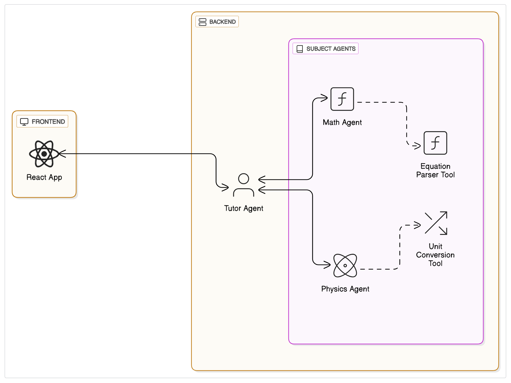

# 📚 Intelligent Tutoring System with Multi-Agent Architecture

This project is an intelligent tutoring system that utilizes a **multi-agent architecture** to provide domain-specific assistance in **Mathematics** and **Physics**. Built using **React** on the frontend and powered by the **ADK Multi-Agent Framework**, the system features:

- A **Tutor Agent** that acts as the central coordinator  
- Two **Sub-Agents**: `MathAgent` and `PhysicsAgent` for subject-specific queries

---

## 🧠 Architecture

### 🔷 Frontend

- **React-based** user interface allowing seamless interaction with the tutoring system.

### 🔷 Agent System

Built using the **ADK (Agent Development Kit)** with multi-agent support.

#### TutorAgent

- Acts as the **central coordinator**
- Intercepts incoming queries
- Identifies the subject of the question
- Delegates the task to the appropriate sub-agent

#### MathAgent

- Handles all **math-related queries**, such as:
  - Algebra
  - Calculus
  - Arithmetic
  - Geometry, etc.

#### PhysicsAgent

- Handles **physics-related questions**, including:
  - Mechanics
  - Thermodynamics
  - Motion, etc.

---

## 🛠️ Tech Stack

| Layer          | Technology             |
|----------------|------------------------|
| Frontend       | React                  |
| Backend        | ADK (Multi-Agent)      |
| Language       | JavaScript, Python (if applicable) |
| Communication  | FastAPI                |

---

## 📁 Project Structure

## 📁 Project Structure

- `tutor-ai/`
  - `frontend/`
    - `react-app/` – React-based UI
  - `backend/`
    - `TutorAgent/` – Central coordinating agent
    - `MathAgent/` – Math subject agent
    - `PhysicsAgent/` – Physics subject agent
  - `docs/`
    - `system-architecture/` – System design overview
  - `README.md` – Project documentation

